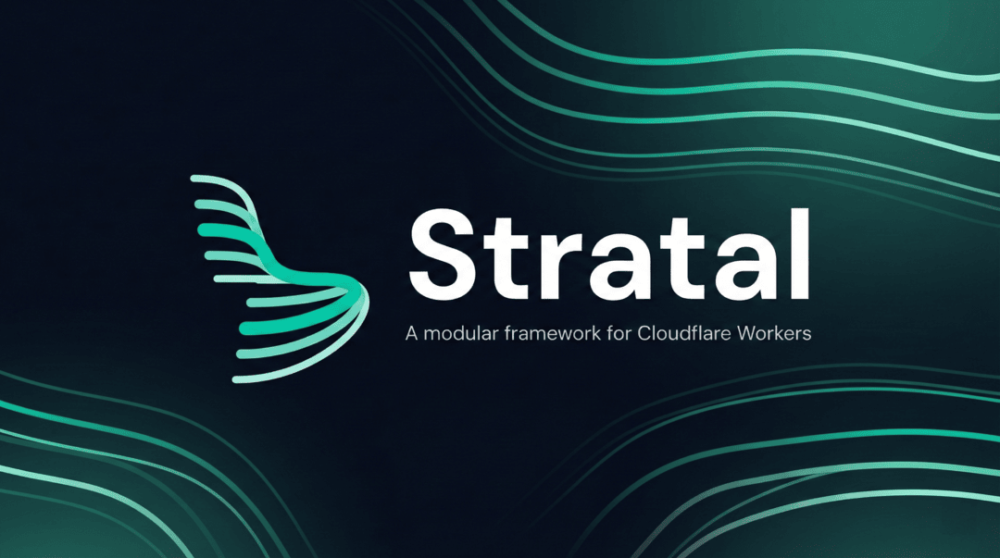

# Stratal

<p align="center">
  
</p>

A modular framework for building Cloudflare Workers with dependency injection, OpenAPI documentation, queues, cron jobs, and more.

[](https://www.npmjs.com/package/stratal)
[](https://github.com/strataljs/stratal/actions/workflows/ci.yml)
[](https://opensource.org/licenses/MIT)

## Features

- **Dependency Injection** - Two-tier DI container (global + request-scoped) powered by tsyringe
- **OpenAPI Documentation** - Define Zod schemas once and get a full OpenAPI 3.0 spec with interactive docs
- **Modular Architecture** - NestJS-style modules with lifecycle hooks, dynamic configuration, and middleware
- **Hono Routing** - Convention-based RESTful controllers with automatic HTTP method mapping
- **Queue Consumers** - Typed Cloudflare Queue consumers with message-type filtering
- **Cron Jobs** - Scheduled tasks via Cloudflare Workers cron triggers
- **Storage** - S3-compatible file storage with presigned URLs and TUS upload support
- **Email** - Resend and SMTP providers with React Email template support
- **i18n** - Type-safe internationalization with locale detection from request headers
- **Guards and Middleware** - Route protection and per-module middleware configuration

## Installation

```bash
npm install stratal
# or
yarn add stratal
```

### AI Agent Skills

Stratal provides [Agent Skills](https://agentskills.io) for AI coding assistants like Claude Code and Cursor. Install to give your AI agent knowledge of Stratal patterns, conventions, and APIs:

```bash
npx skills add strataljs/stratal
```

## Quick Start

Define a module with a controller and wire it up as a Cloudflare Worker:

```typescript
import { Module, StratalWorker, type ApplicationConfig } from 'stratal'
import { Controller, Route, type RouterContext } from 'stratal/router'
import { z } from 'stratal/validation'

// Define a controller
@Controller('/api/greetings')
class GreetingsController {
  @Route({
    summary: 'Say hello',
    response: z.object({ message: z.string() }),
  })
  async index(ctx: RouterContext) {
    return ctx.json({ message: 'Hello from Stratal!' })
  }
}

// Create the root module
@Module({
  controllers: [GreetingsController],
})
class AppModule {}

// Worker entry point
export default class Backend extends StratalWorker {
  protected configure(): ApplicationConfig {
    return { module: AppModule }
  }
}
```

## Documentation

Full guides and examples are available at **[stratal.dev](https://stratal.dev)**. API reference lives at **[api-reference.stratal.dev](https://api-reference.stratal.dev)**.

## Contributing

Contributions are welcome! Please see [CONTRIBUTING.md](CONTRIBUTING.md) for guidelines.

## License

MIT
