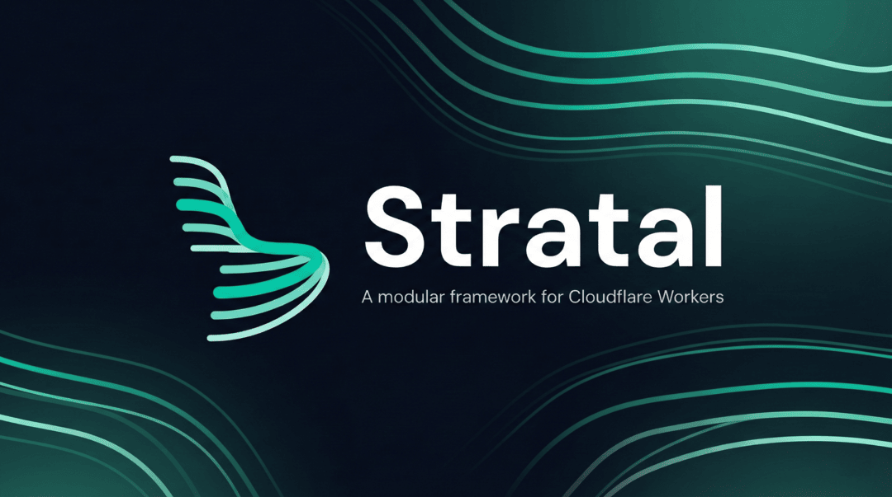

# Stratal

<p align="center">
  
</p>

A modular framework for building Cloudflare Workers with dependency injection, OpenAPI documentation, queues, cron jobs, and more.

[](https://www.npmjs.com/package/stratal)
[](https://github.com/strataljs/stratal/actions/workflows/ci.yml)
[](https://github.com/strataljs/stratal/actions/workflows/benchmark.yml)
[](https://opensource.org/licenses/MIT)
[](https://securityscorecards.dev/viewer/?uri=github.com/strataljs/stratal)
[](https://snyk.io/test/github/strataljs/stratal)
[](https://www.npmjs.com/package/stratal)
[](https://www.typescriptlang.org/)
[](https://bundlephobia.com/package/stratal)
[](https://github.com/strataljs/stratal/pulls)
[](https://github.com/strataljs/stratal)

## Features

- **Dependency Injection** - Two-tier DI container (global + request-scoped) powered by tsyringe
- **OpenAPI Documentation** - Define Zod schemas once and get a full OpenAPI 3.0 spec with interactive docs
- **Modular Architecture** - NestJS-style modules with lifecycle hooks, dynamic configuration, and middleware
- **Hono Routing** - Convention-based RESTful controllers with automatic HTTP method mapping
- **Queue Consumers** - Typed Cloudflare Queue consumers with message-type filtering
- **Cron Jobs** - Scheduled tasks via Cloudflare Workers cron triggers
- **Storage** - S3-compatible file storage with presigned URLs and TUS upload support
- **Email** - Resend and SMTP providers with React Email template support
- **i18n** - Type-safe internationalization with locale detection from request headers
- **Guards and Middleware** - Route protection and per-module middleware configuration

> **Note:** Stratal is in active development and APIs may change before v1. It is okay to use in projects, but consider pinning your dependency version so that a new patch does not break your existing code.

## Installation

```bash
npm install stratal
# or
yarn add stratal
```

## Packages

| Package | npm | Description |
|---|---|---|
| `stratal` | [](https://www.npmjs.com/package/stratal) | Core framework — modules, DI, routing, OpenAPI, queues, cron, storage, email, i18n |
| `@stratal/testing` | [](https://www.npmjs.com/package/@stratal/testing) | Testing utilities and mocks |
| `@stratal/framework` | [](https://www.npmjs.com/package/@stratal/framework) | Auth (Better Auth), database ORM (ZenStack), RBAC (Casbin), guards, factories |
| `@stratal/seeders` | [](https://www.npmjs.com/package/@stratal/seeders) | Database seeder CLI and infrastructure |
| `@stratal/zenstack-plugin` | [](https://www.npmjs.com/package/@stratal/zenstack-plugin) | ZenStack CLI plugin for multi-connection schema slicing and migrations |

### AI Agent Skills

Stratal provides [Agent Skills](https://agentskills.io) for AI coding assistants like Claude Code and Cursor. Install to give your AI agent knowledge of Stratal patterns, conventions, and APIs:

```bash
npx skills add strataljs/stratal
```

| Skill | Description |
|---|---|
| `stratal` | Core framework — modules, DI, controllers, routing, OpenAPI, queues, cron, email, storage, caching, i18n, logging, guards, middleware, config, events, and error handling |
| `stratal-testing` | Testing — TestingModule, HTTP testing, mocks, fakes, and auth testing utilities |
| `stratal-framework` | Framework modules — authentication (Better Auth), database (ZenStack ORM), RBAC (Casbin), AuthGuard, and test data factories |
| `stratal-seeders` | Database seeders — writing seeders, CLI usage, and seeder registration |
| `stratal-zenstack-plugin` | ZenStack plugin — multi-connection schema slicing, database migrations, and the stratal-db CLI |

## Quick Start

Define a module with a controller and wire it up as a Cloudflare Worker:

```typescript
import { Stratal } from 'stratal'
import { Module } from 'stratal/module'
import { Controller, Route, type RouterContext } from 'stratal/router'
import { z } from 'stratal/validation'

// Define a controller
@Controller('/api/greetings')
class GreetingsController {
  @Route({
    summary: 'Say hello',
    response: z.object({ message: z.string() }),
  })
  async index(ctx: RouterContext) {
    return ctx.json({ message: 'Hello from Stratal!' })
  }
}

// Create the root module
@Module({
  controllers: [GreetingsController],
})
class AppModule {}

// Worker entry point
export default new Stratal({ module: AppModule })
```

## Documentation

Full guides and examples are available at **[stratal.dev](https://stratal.dev)**. API reference lives at **[api-reference.stratal.dev](https://api-reference.stratal.dev)**.

## Benchmarks

### Request / Response (e2e)

Full request lifecycle: DI resolution → middleware → routing → validation → response serialization.

| Benchmark | ops/sec | ±% | Median | P99 |
|---|--:|--:|--:|--:|
| simple GET - 200 | 99,191 | ±0.73% | 10.1 µs | 17.8 µs |
| GET with route params - 200 | 80,096 | ±0.74% | 12.5 µs | 19.5 µs |
| POST with JSON body - 201 | 49,954 | ±0.74% | 20.0 µs | 31.9 µs |
| POST invalid body - validation error | 23,587 | ±3.19% | 42.4 µs | 71.8 µs |
| GET unknown route - 404 | 43,228 | ±0.69% | 23.1 µs | 34.8 µs |

### DI Container - Registration

| Benchmark | ops/sec | ±% | Median | P99 |
|---|--:|--:|--:|--:|
| register class provider | 5,396,472 | ±0.91% | 0.20 µs | 0.30 µs |
| registerSingleton | 5,061,380 | ±0.63% | 0.20 µs | 0.30 µs |
| registerValue | 5,264,393 | ±0.58% | 0.20 µs | 0.30 µs |
| registerFactory | 4,966,905 | ±0.67% | 0.20 µs | 0.30 µs |

### DI Container - Resolution

| Benchmark | ops/sec | ±% | Median | P99 |
|---|--:|--:|--:|--:|
| resolve class token | 2,259,399 | ±0.73% | 0.40 µs | 0.60 µs |
| resolve symbol token | 2,085,313 | ±0.88% | 0.50 µs | 0.70 µs |
| resolve value token | 2,252,901 | ±0.45% | 0.40 µs | 0.60 µs |
| resolve singleton token | 2,180,625 | ±0.53% | 0.50 µs | 0.60 µs |
| isRegistered check | 2,786,645 | ±0.51% | 0.40 µs | 0.50 µs |

### DI Container - Conditional Binding

| Benchmark | ops/sec | ±% | Median | P99 |
|---|--:|--:|--:|--:|
| when().use().give().otherwise() | 1,545,062 | ±3.07% | 0.50 µs | 1.10 µs |
| when() with cached predicate | 1,630,576 | ±2.65% | 0.50 µs | 1.00 µs |

### Module Registry - Registration

| Benchmark | ops/sec | ±% | Median | P99 |
|---|--:|--:|--:|--:|
| register single module | 2,155,261 | ±0.95% | 0.50 µs | 0.60 µs |
| register 3-level module tree | 1,028,422 | ±0.41% | 1.00 µs | 1.30 µs |
| register dynamic module (forRoot) | 2,107,991 | ±1.60% | 0.50 µs | 1.00 µs |

### Module Registry - Initialization

| Benchmark | ops/sec | ±% | Median | P99 |
|---|--:|--:|--:|--:|
| initialize with lifecycle hooks | 1,657,987 | ±0.12% | 0.60 µs | 0.80 µs |

### Module Registry - Collection

| Benchmark | ops/sec | ±% | Median | P99 |
|---|--:|--:|--:|--:|
| getAllControllers | 983,234 | ±0.72% | 1.00 µs | 2.30 µs |
| getAllConsumers | 1,000,669 | ±0.46% | 1.00 µs | 1.30 µs |
| getAllJobs | 1,003,687 | ±0.46% | 1.00 µs | 1.30 µs |

### Route Registration

| Benchmark | ops/sec | ±% | Median | P99 |
|---|--:|--:|--:|--:|
| controller with 5 OpenAPI routes | 42,263 | ±4.73% | 21.9 µs | 42.2 µs |
| single-route controller | 215,349 | ±3.33% | 4.60 µs | 8.00 µs |
| register multiple controllers | 38,840 | ±3.69% | 19.8 µs | 51.8 µs |

### Application

| Benchmark | ops/sec | ±% | Median | P99 |
|---|--:|--:|--:|--:|
| constructor only | 312,943 | ±1.69% | 2.70 µs | 7.70 µs |
| full initialize() | 48,051 | ±4.92% | 16.3 µs | 43.1 µs |
| resolve service after bootstrap | 45,913 | ±5.33% | 16.2 µs | 42.7 µs |

> Benchmarks ran on: Apple M3 Max (16-core), 48 GB RAM, macOS 26.2, Node.js v22.12.0

## Contributing

Contributions are welcome! Please see [CONTRIBUTING.md](CONTRIBUTING.md) for guidelines.

## License

MIT
